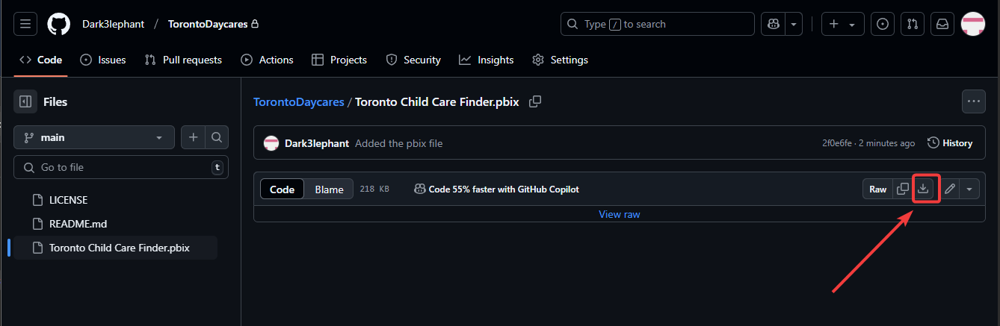
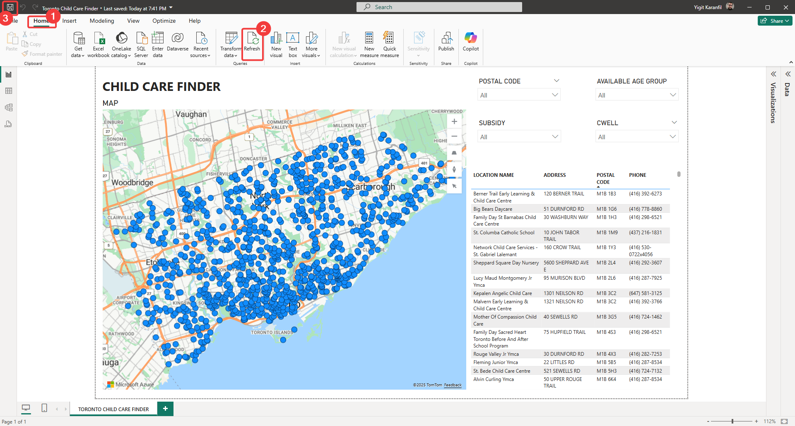
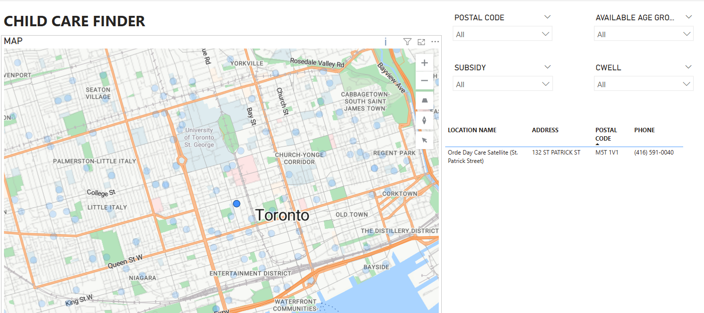
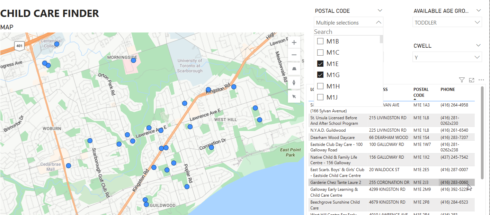

# Toronto Child Care Finder

 A tool to help you sort through the madness that is finding care for your child in Toronto. While this doens't fix any of the systematic issues that causes the shortage, I hope it makes your search easier.
 

## Disclaimers

1. This tool utilizes City of Toronto's [Open Data Portal](https://open.toronto.ca), specifically [Licensed Child Care Centres](https://open.toronto.ca/dataset/licensed-child-care-centres/) dataset. 

2. While this is a convenient tool to search, I recommend checking other sources as I've seen daycare centres in my area missing from this dataset in the past(they were licensed by Ontario, I checked).

3. You will need to download and install Power BI desktop to use this. Power BI is a complex data analysis software, but *you don't need to know Power BI* to use the daycare finder. Everything is setup in a user-friendly dashboard. 

4. Website/email of daycare centres are not present in the finder as they are not included in the dataset. 

5. Yes, I know Ontario Ministry of Education has a daycare finder here: https://www.earlyyears.edu.gov.on.ca/LCCWWeb/childcare/search.xhtml but it is seemingly built to make parents desparate to find care for their children suffer just a bit more. You can either see a list, or pins on Google maps. You would think that you can click on the pins to show the daycare information but NOPE!

## Install PowerBI

You can install by downloading the excecutable from [this link](https://www.microsoft.com/en-us/download/details.aspx?id=58494) or get it from [Microsoft Store](https://aka.ms/pbidesktopstore).

## Start Using the Daycare Finder

Navigate to the [pbix](https://github.com/Dark3lephant/TorontoDaycares/blob/main/Toronto%20Child%20Care%20Finder.pbix) file and click the download button:

Double-click the file to open. You will see the "report" page with everything on your screen where you can search with the map, filter by age group, postal code or CWELL/subsidy status. 

### IMPORTANT: Click the refresh button and save before you start searching. 

This will pull the latest data from City of Toronto's Open Data Portal instead of data from when I uploaded this.

## Start Searching

You will see the map on left side, slicers on top right, and list of daycares on botom right side of the screen. 

You can use the buttons or your mouse wheel to zoom in/out of the map and left mouse button to drag it around, similar to most map applications. If you select one of the locations on map, it will filter the list and show that location's information.

Alternatively, you can use slicers (the drop-down buttons on top right) to filter by age group, postal code, subsidy and CWELL allowances. Postal code only contains the first 3 letters as using further letters will cover a very small area. 

Example: You can use multiple postal codes and look for a toddler spot that is in CWELL program like this:  

I hope this helps someone and may the odds ever be in your favour. It is a little ridiculous that I can even justify building this thing and I hope it becomes obsolete someday. 